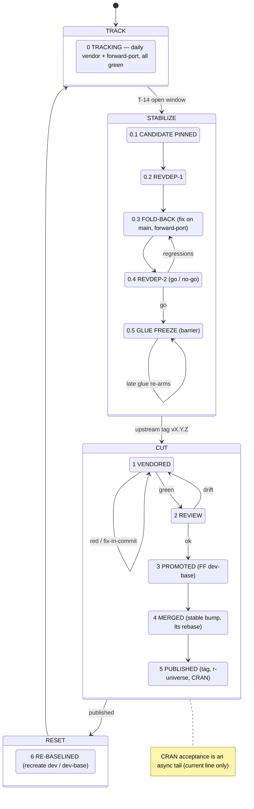

# R Package Release Process

This document describes the release process for one DuckDB release line as a
**finite state machine (FSM)**. It is the operational companion to
[`BRANCHES.md`](BRANCHES.md), which defines the branch model, the package
flavors, and the **[series invariants](BRANCHES.md#series-invariants)** that this
process must preserve at every step.

A **series** is one DuckDB minor line `L` (e.g. `v1.4-andium`) together with its
branches:

- `stable` — published branch on `duckdb/duckdb-r` (`Package: duckdb`). For the
  *current* line this is literally `main`.
- `lts` — `stable` + the flavor rename (`Package: duckdb.L`); exists only for an
  LTS line.
- `dev` — bleeding edge on `krlmlr/duckdb-r` (`Package: duckdb.L.dev`), vendored
  daily from the upstream branch for `L`.
- `dev-base` — the last reviewed/released point of `dev`.

At any moment a series is in exactly one of four **clusters**. The clusters —
not the individual states — are the unit of coordination when several series
release together (see [Multi-line coordination](#multi-line-coordination)).

## Clusters

| Cluster | States | Driver | Mutates `main` glue? | Vendored commits → mainline? | Loops? |
|---------|--------|--------|----------------------|------------------------------|--------|
| **TRACK** | 0 | automation (daily) | no — forward-ports pass *through* | no | — |
| **STABILIZE** | 0.1–0.5 | calendar / human (T−14 → tag) | **yes** (fold-back fixes are born here) | no | revdep ⇄ fold-back |
| **CUT** | 1–5 | upstream tag, then mechanical | no | **yes — the only cluster that does** | red ⇄ fix-in-commit |
| **RESET** | 6 | script | no | no | — |

The single most important property of the whole design lives in the last two
columns: **vendored commits enter the mainline in exactly one cluster (CUT), and
`main`'s glue changes only in TRACK / STABILIZE.** The two never overlap, which is
what keeps `main` CRAN-releasable at all times.

## State diagram



## States

| State | Enter when | `dev` | `dev-base` | `stable` / `lts` | Gate to leave | On failure |
|-------|-----------|-------|-----------|------------------|---------------|------------|
| **0 TRACKING** | RESET done | grows: vendor + forward-port, all green | frozen | frozen at `X.Y.(Z-1)` | maintainer opens window (≈ T−14) | — |
| **0.1 CANDIDATE PINNED** | window opens | fixes only; pin likely release commit | frozen | frozen | candidate green | — |
| **0.2 REVDEP-1** | candidate pinned | — | — | — | revdep run triaged | — |
| **0.3 FOLD-BACK** | findings exist | fold-back forward-ports land | frozen | **fixes born here**, then ported | findings resolved/accepted | loop to 0.4 |
| **0.4 REVDEP-2** | ≈ T−7 | — | — | — | **go / no-go** | fail → 0.3 |
| **0.5 GLUE FREEZE** | go | frozen (barrier; all lines aligned) | frozen | frozen | upstream tags `vX.Y.Z` | late glue → re-arm 0.5 |
| **1 VENDORED** | tag lands on `dev` | tagged vendor commit present | frozen | frozen | tagged commit **green** (`each.yaml`) | red → fix in-commit, force-push `dev` |
| **2 REVIEW** | green | — | — | — | `dev-base..tagged` clean | drift → fix on `main`, forward-port |
| **3 PROMOTED** | review ok | — | **FF → tagged commit** | — | dev-base advanced | — |
| **4 MERGED** | promoted | frozen at tagged commit | — | PR `tagged → stable` green; `fledge` bump to `X.Y.Z`; `lts` rebased | stable green | version conflict (merge driver) / red CI |
| **5 PUBLISHED** | merged | — | — | tag `vX.Y.Z` pushed; r-universe builds; CRAN submitted (current line) | tag pushed | CRAN reject → new patch cycle |
| **6 RE-BASELINED** | published | force-recreated from new `stable` + flavor | recreated | — | back to TRACK | — |

---

## TRACK — steady state

Fully automated; there is nothing to do. `vendor.yaml` runs daily and advances
`dev` by a bounded batch, gated on the `rcc` commit-status of the last green base
(`scripts/vendor-gate.sh`); `each.yaml` checks every new commit, and glue changes
flow in from `main` via the forward-port chain. `dev-base..dev` is the running
list of "what would ship if we released now."

A maintainer leaves TRACK by **opening the release window** (≈ two weeks before
the expected upstream release date), which enters STABILIZE.

## STABILIZE — pre-release (≈ T−14 → tag)

The goal is to prove the release *candidate* — the `dev` branch — against
reverse dependencies **before upstream cuts the tag**, so that regressions can be
folded back (into our glue, into `patch/`, or reported upstream) while there is
still time. STABILIZE mutates only `main` (fold-back fixes) and `dev`
(forward-ports + ongoing vendor); the release branches stay at the previous
release (invariant **P1**), so the whole cluster is abortable with zero rollback.

### Preflight

- Review the upstream **R workflow** R CMD check for the candidate revision:
  <https://github.com/duckdb/duckdb/actions/workflows/R.yml>. Errors and warnings
  are show-stoppers. The package-size NOTE and the "Note to CRAN Maintainers" are
  fine; other NOTEs usually indicate real problems.
- Review the current **CRAN checks** page:
  <https://cran.r-project.org/web/checks/check_results_duckdb.html>. Anything in
  red, or any WARNING/NOTE other than package size, must be addressed.

### 0.1 Pin the release candidate

Upstream commits land up to and including release day, so the release commit is a
moving target. **Ask upstream for the most likely release commit** and pin it.
From here, only fixes (not features) flow into the glue source of truth. Re-pin
as upstream advances; a re-pin only forces a re-run of the revdep checks if the
delta touches anything risky (invariant **P2**: what ships must have been tested).

### 0.2 / 0.4 Reverse-dependency checks

Run against the `.dev` build at the pinned commit. The first pass is early enough
to act on; the second (≈ T−7) is the go/no-go gate.

```r
remotes::install_github("r-lib/revdepcheck") # once
revdepcheck::revdep_check(num_workers = 8, env = c(MAKEVARS = "-j8"))
```

CRAN policy requires contacting affected maintainers **well beforehand**, which is
the entire reason this happens before the tag rather than after.

### 0.3 Fold back

Every fold-back fix is **born on `main`** and forward-ported down the chain — never
authored directly on a `dev` branch (invariant **P3** / **S4**). C++ issues go into
`patch/` and are simultaneously sent upstream as a PR so the patch can eventually
be retired. Contact the maintainers of any broken reverse dependencies. Loop back
to 0.4 until clean or explained.

### 0.5 Glue freeze (barrier)

Freeze glue across **all** releasing series and confirm `git cherry main dev` is
empty for each (invariant **P4**) — every releasing line now carries identical
glue. A late glue change after this point is allowed but **re-arms the freeze**:
land it on `main`, forward-port to every releasing `dev`, re-run a targeted
revdep, and only then proceed. The clock resets to 0.5; it is not a scramble.

## CUT — release execution

Triggered by upstream tagging `vX.Y.Z`. This is the only cluster that moves
vendored commits into the mainline, and it does so through reviewed, green,
gated steps. **You release the tagged commit, not the `dev` tip** — upstream has
usually moved on by now, and the post-tag commits stay queued for the next cycle.

### 1 VENDORED → 2 REVIEW → 3 PROMOTED

1. `vendor.yaml` produces the `vendor: … (tag vX.Y.Z) …` commit on `dev`; wait for
   `each.yaml` to show it **green**. If vendoring broke the build, fix it in the
   same commit and force-push `dev`.
2. Review the pending window — `https://github.com/krlmlr/duckdb-r/compare/<dev-base>...<tagged>`
   — and confirm it contains only the expected vendor commits and intended
   forward-ports, with no glue drift.
3. Fast-forward `dev-base` to the tagged commit (`scripts/promote-dev.sh L`, when
   available; otherwise `git push krlmlr <tagged>:refs/heads/L-dev-base`).

### 4 MERGED — stable + version bump

Bring the tagged `dev` content onto `stable` **linearly — never as a merge
commit** (invariant **L**): fast-forward or rebase the tagged range onto
`stable`, dropping the `lts.sh` flavor rename. The `DESCRIPTION` version conflict
is resolved automatically by the merge driver (see
[BRANCHES.md → Version Numbering](BRANCHES.md#version-numbering)); run
`scripts/setup-git.sh` first if this is a fresh clone or CI runner. Because
`release-content ⊑ dev-base ⊑ dev` (invariant **A1**), the only rewriting is
dropping the rename commit.

The package version is **not** derived from the git tag — set it explicitly so
`DESCRIPTION` matches the upstream tag:

```r
fledge::bump_version("X.Y.Z")
```

Then rebase the `lts` branch (one rename commit on top of `stable`):

```bash
# in the L-lts worktree
git rebase origin/L && git push origin L-lts
```

### WinBuilder + final checks

Obtain the source tarball from the CI build artifact (`r-package-source`) or the
post-CI GitHub release (`duckdb_<version>.tar.gz`). Build it from
`duckdb/duckdb@main` rather than a fork, so the git revision ids used to fetch
extensions are correct. Upload to WinBuilder (R-devel):
<https://win-builder.r-project.org/upload.aspx>. Apart from the known
package-size NOTE, warnings and notes are blockers.

### 5 PUBLISHED — tag & publish

Tag the release and push; r-universe rebuilds automatically:

```bash
git tag vX.Y.Z origin/L-lts   # or origin/L per series convention
git push origin vX.Y.Z
```

For the **current** line (the CRAN `duckdb` package), submit the source tarball at
<https://cran.r-project.org/submit.html>. The maintainer (currently Hannes)
confirms the upload, after which CRAN's automated checks run. CRAN acceptance is
**asynchronous** — it can take days and overlaps RESET and the next TRACK. If CRAN
rejects, fix on `stable` and re-enter CUT as a follow-up patch. LTS lines publish
to r-universe only and have no CRAN tail.

## RESET — re-baseline

Recreate the dev baseline from the freshly released `stable` tip plus the flavor
rename, returning the series to TRACK:

```bash
git checkout -b L-dev-base origin/L
scripts/lts.sh L.dev
git push krlmlr L-dev-base --force-with-lease
git push krlmlr L-dev-base:L-dev --force-with-lease
```

The glue source of truth (`main`) separately moves to its ongoing development
version (4th component, e.g. `X.Y.Z.9000`) via `fledge`; the `dev` branches then
resume bumping the 5th (vendor) component from the new baseline.

## Multi-line coordination

When several series release together (e.g. a current line on CRAN plus an LTS line
on r-universe), coordinate at the **cluster** level:

- **STABILIZE ends on a shared barrier.** All releasing lines must reach
  **0.5 GLUE FREEZE** together — this is the forward-port barrier that guarantees
  identical glue across lines (invariant **P4**). It is the one hard
  synchronization point.
- **CUT runs per line, pipelined, CRAN line first.** Submit the CRAN line early
  because its acceptance is asynchronous; the r-universe-only LTS line finishes
  alongside with no CRAN tail.
- **The preview line** (next major, tracking upstream `main`) lives in a
  long-running TRACK/STABILIZE: its STABILIZE *is* the upstream RC window and its
  CUT *is* the atomic fast-forward flip of `main`. The flip requires `main ⊑
  main-dev` (invariant **A2**), which is *not* maintained continuously — it is
  established once, just before the flip, by the rewind-to-bifurcation + replay
  linearization. Same FSM, different durations; the only other addition is that
  vendor-coupled glue may be *born* on its `dev` (the documented exception to
  invariant **S4**).

## Failure & rollback

| Failure | State | Response |
|---------|-------|----------|
| Vendor breaks the build | 1 VENDORED | fix in the same commit, force-push `dev`, re-green |
| Glue drift found in review | 2 REVIEW | fix on `main`, forward-port, back to 1 |
| Revdep regression | 0.2 / 0.4 | fold back on `main` (0.3), loop |
| Late glue change | 0.5 / CUT | land on `main`, forward-port to all, re-revdep, re-freeze |
| Merge conflict on version | 4 MERGED | resolved by the merge driver; run `scripts/setup-git.sh` |
| CRAN rejection | after 5 | fix on `stable`, re-enter CUT as a follow-up patch |
| Upstream re-tags | any | treat as a fresh CUT entry on the new tag |

## Invariants preserved per cluster

Each cluster must leave the series satisfying the
**[series invariants](BRANCHES.md#series-invariants)**:

- **TRACK / STABILIZE** maintain **S1–S4**, **G1–G2**, **C1–C2**, and the
  prerelease invariants **P1–P4**.
- **CUT** is the controlled transition where `dev-base` catches up to the tagged
  commit and `stable`/`lts` advance; **V1–V4** and **F1–F2** must hold at the new
  release point.
- **RESET** re-establishes **S2** (baseline purity) for the next cycle.
