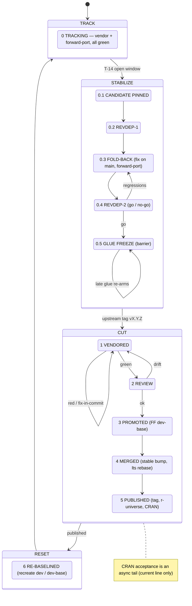

# The release process

Releasing one DuckDB line, as a **finite state machine**:
clusters, states, gates, multi-line coordination, and rollback.
It operates on the branch model of
[`branches/model/`](/handbook/branches/model/README.md)
and must leave every series invariant standing
([`branches/invariants/`](/handbook/branches/invariants/README.md)).
The reverse-dependency runs are
[`testing/revdep/`](/handbook/testing/revdep/README.md)'s,
the version counters
[`versioning/`](/handbook/operations/releases/versioning/README.md)'s,
and CRAN submission
[`cran/`](/handbook/operations/releases/cran/README.md)'s.

Two placeholders run through this page.
`L` is the upstream line — `v1.4-andium`, `v1.5-variegata`, `main` —
and `N` is its `major.minor` token, `1.4` or `1.5`,
which is what a flavor suffix is built from
([`branches/flavors/`](/handbook/branches/flavors/README.md)).

The machine is written in the **legacy `dev`/`dev-base` layout**,
where a line has a published branch, an optional LTS rename,
a bleeding-edge `dev`, and a `dev-base` marking its last reviewed point.
A series reseeded into the series loop has the loop's four refs instead,
and reconciling the two is open work — see the closing line.

At any moment a series is in exactly one of four **clusters**.
The clusters — not the individual states — are the unit of coordination
when several series release together
(see [Multi-line coordination](#multi-line-coordination)).

## Clusters

| Cluster | States | Driver | Mutates `main` glue? | Vendored commits → mainline? | Loops? |
|---------|--------|--------|----------------------|------------------------------|--------|
| **TRACK** | 0 | the series loop | no — forward-ports pass *through* | no | — |
| **STABILIZE** | 0.1–0.5 | calendar / human (T−14 → tag) | **yes** (fold-back fixes are born here) | no | revdep ⇄ fold-back |
| **CUT** | 1–5 | upstream tag, then mechanical | no | **yes — the only cluster that does** | red ⇄ fix-in-commit |
| **RESET** | 6 | script | no | no | — |

The single most important property of the whole design is the pair of
middle columns: **vendored commits enter the mainline in exactly one
cluster (CUT), and `main`'s glue changes only in TRACK and STABILIZE.**
The two never overlap,
which is what keeps `main` CRAN-releasable at all times.

## State diagram



## States

| State | Enter when | `dev` | `dev-base` | `stable` / `lts` | Gate to leave | On failure |
|-------|-----------|-------|-----------|------------------|---------------|------------|
| **0 TRACKING** | RESET done | grows: vendor + forward-port, all green | frozen | frozen at `X.Y.(Z-1)` | maintainer opens window (≈ T−14) | — |
| **0.1 CANDIDATE PINNED** | window opens | fixes only; pin likely release commit | frozen | frozen | candidate green | — |
| **0.2 REVDEP-1** | candidate pinned | — | — | — | revdep run triaged | — |
| **0.3 FOLD-BACK** | findings exist | fold-back forward-ports land | frozen | **fixes born here**, then ported | findings resolved/accepted | loop to 0.4 |
| **0.4 REVDEP-2** | ≈ T−7 | — | — | — | **go / no-go** | fail → 0.3 |
| **0.5 GLUE FREEZE** | go | frozen (barrier; all lines aligned) | frozen | frozen | upstream tags `vX.Y.Z` | late glue → re-arm 0.5 |
| **1 VENDORED** | tag lands on `dev` | tagged vendor commit present | frozen | frozen | tagged commit **green** (`each.yaml`) | red → fix in-commit, force-push `dev` |
| **2 REVIEW** | green | — | — | — | `dev-base..tagged` clean | drift → fix on `main`, forward-port |
| **3 PROMOTED** | review ok | — | **FF → tagged commit** | — | dev-base advanced | — |
| **4 MERGED** | promoted | frozen at tagged commit | — | PR `tagged → stable` green; `fledge` bump to `X.Y.Z`; `lts` rebased | stable green | version conflict (merge driver) / red CI |
| **5 PUBLISHED** | merged | — | — | tag `vX.Y.Z` pushed; r-universe builds; CRAN submitted (current line) | tag pushed | CRAN reject → new patch cycle |
| **6 RE-BASELINED** | published | force-recreated from new `stable` + flavor | recreated | — | back to TRACK | — |

The **On failure** column is the whole of rollback:
there is no state this machine cannot be walked back out of,
and no failure that discards a green commit.

## TRACK — steady state

Nothing to do: this is the series loop running unattended
([`operations/vendoring/series-loop/`](/handbook/operations/vendoring/series-loop/README.md)),
with `each.yaml` judging every new commit
([`operations/ci/per-commit/`](/handbook/operations/ci/per-commit/README.md)),
and glue changes flowing in from `main` through the forward-port chain.
The trusted frontier is "what would ship if we released now."

A maintainer leaves TRACK by **opening the release window**,
about two weeks before the expected upstream release date,
which enters STABILIZE.

## STABILIZE — pre-release (≈ T−14 → tag)

The goal is to prove the release *candidate* against reverse dependencies
**before upstream cuts the tag**,
so that regressions can be folded back — into the glue, into `patch/`,
or reported upstream — while there is still time.
STABILIZE mutates only `main` (fold-back fixes)
and `dev` (forward-ports plus ongoing vendoring);
the release branches stay at the previous release,
so the whole cluster is abortable with zero rollback.

### Preflight

* Review the upstream **R workflow** `R CMD check`
  for the candidate revision:
  <https://github.com/duckdb/duckdb/actions/workflows/R.yml>.
  Errors and warnings are show-stoppers.
  The package-size NOTE and the "Note to CRAN Maintainers" are fine;
  other NOTEs usually indicate real problems.
* Review the current **CRAN checks** page:
  <https://cran.r-project.org/web/checks/check_results_duckdb.html>.
  Anything in red, or any WARNING or NOTE other than package size,
  must be addressed.

### 0.1 Pin the release candidate

Upstream commits land up to and including release day,
so the release commit is a moving target.
**Ask upstream for the most likely release commit** and pin it.
From here, only fixes flow into the glue source of truth, not features.
Re-pin as upstream advances;
a re-pin forces a re-run of the reverse-dependency checks only if the
delta touches anything risky — what ships must have been tested.

### 0.2 / 0.4 Reverse-dependency checks

Two runs against the pinned candidate:
an early pass with time to act on what it finds,
and a second at about T−7 that is the go/no-go gate.
How they are run and where the results land is
[`testing/revdep/`](/handbook/testing/revdep/README.md)'s.

### 0.3 Fold back

Every fold-back fix is **born on `main`** and forward-ported down the
chain — never authored directly on a `dev` branch.
C++ issues go into `patch/` and are simultaneously sent upstream as a
pull request, so the patch can eventually retire
([`operations/vendoring/pipeline/`](/handbook/operations/vendoring/pipeline/README.md)).
Contact the maintainers of any broken reverse dependencies.
Loop back to 0.4 until clean or explained.

### 0.5 Glue freeze (barrier)

Freeze glue across **all** releasing series
and confirm `git cherry main dev` is empty for each —
every releasing line now carries identical glue.
A late glue change after this point is allowed
but **re-arms the freeze**: land it on `main`,
forward-port it to every releasing `dev`, re-run a targeted revdep,
and only then proceed.
The clock resets to 0.5; it is not a scramble.

## CUT — release execution

Triggered by upstream tagging `vX.Y.Z`.
This is the only cluster that moves vendored commits into the mainline,
and it does so through reviewed, green, gated steps.
**You release the tagged commit, not the `dev` tip** —
upstream has usually moved on by now,
and the post-tag commits stay queued for the next cycle.

### 1 VENDORED → 2 REVIEW → 3 PROMOTED

1. The series loop produces the `vendor: … (tag vX.Y.Z) …` commit on
   `dev`; wait for `each.yaml` to show it **green**.
   If vendoring broke the build, fix it in the same commit and
   force-push `dev`.
2. Review the pending window —
   `https://github.com/krlmlr/duckdb-r/compare/<dev-base>...<tagged>` —
   and confirm it contains only the expected vendor commits and intended
   forward-ports, with no glue drift.
3. Fast-forward `dev-base` to the tagged commit:
   `git push krlmlr <tagged>:refs/heads/L-dev-base`.

### 4 MERGED — stable and the version bump

Bring the tagged `dev` content onto `stable`
**linearly, never as a merge commit** — the active history stays
merge-free so it stays bisectable.
Fast-forward or rebase the tagged range onto `stable`,
dropping the flavor rename commit.
The `DESCRIPTION` version conflict is resolved automatically by the merge
driver ([`versioning/`](/handbook/operations/releases/versioning/README.md));
run [`scripts/setup-git.sh`](/scripts/setup-git.sh) first
if this is a fresh clone or CI runner.
Because `dev` descends from its release point,
the only rewriting is dropping that rename.

The package version is **not** derived from the git tag —
set it explicitly so `DESCRIPTION` matches the upstream tag:

```r
fledge::bump_version("X.Y.Z")
```

Then rebase the `lts` branch, one rename commit on top of `stable`:

```bash
# in the L-lts worktree
git rebase origin/L && git push origin L-lts
```

Build the source tarball and take it through WinBuilder and the CRAN
preflight before tagging
([`cran/`](/handbook/operations/releases/cran/README.md)).

### 5 PUBLISHED — tag and publish

Tag the release and push; r-universe rebuilds automatically:

```bash
git tag vX.Y.Z origin/L-lts   # or origin/L per series convention
git push origin vX.Y.Z
```

For the **current** line only, submit to CRAN
([`cran/`](/handbook/operations/releases/cran/README.md)).
Acceptance is asynchronous and overlaps RESET and the next TRACK,
so the tag and the r-universe publish do not wait for it;
a rejection is fixed on `stable` and re-enters CUT as a follow-up patch.

## RESET — re-baseline

Recreate the dev baseline from the freshly released `stable` tip plus the
flavor rename, returning the series to TRACK:

```bash
git checkout -b L-dev-base origin/L
scripts/flavor.sh N.dev          # the major.minor token, e.g. 1.4.dev
git push krlmlr L-dev-base --force-with-lease
git push krlmlr L-dev-base:L-dev --force-with-lease
```

The glue source of truth (`main`) separately moves to its ongoing
development version via `fledge`,
and the `dev` branches then resume bumping the vendor counter from the
new baseline
([`versioning/`](/handbook/operations/releases/versioning/README.md)).

## Multi-line coordination

When several series release together —
a current line on CRAN plus an LTS line on r-universe —
coordinate at the **cluster** level:

* **STABILIZE ends on a shared barrier.**
  All releasing lines must reach **0.5 GLUE FREEZE** together;
  this is the forward-port barrier that guarantees identical glue across
  lines, and it is the one hard synchronization point.
* **CUT runs per line, pipelined, CRAN line first.**
  Submit the CRAN line early because its acceptance is asynchronous;
  the r-universe-only LTS line finishes alongside with no CRAN tail.
* **The preview line** — the next major, tracking upstream `main` —
  lives in a long-running TRACK/STABILIZE:
  its STABILIZE *is* the upstream release-candidate window,
  and its CUT *is* the atomic fast-forward flip of `main`.
  The flip requires `main` to be an ancestor of `main-dev`,
  which is *not* maintained continuously —
  it is established once, just before the flip,
  by rewinding to the bifurcation and replaying.
  Same machine, different durations;
  the only other addition is that vendor-coupled glue may be *born* on
  its `dev`, the one documented exception to R-side work being born on
  `main`.

## What each cluster must leave standing

Every cluster hands the series on with its invariants intact
([`branches/invariants/`](/handbook/branches/invariants/README.md)):

* **TRACK and STABILIZE** keep the flavor names internally consistent,
  the history linear, the glue identical down the forward-port chain,
  and every `dev` commit green.
* **CUT** is the controlled transition where `dev-base` catches up to the
  tagged commit and the release branches advance;
  the version and flavor invariants must hold at the new release point.
* **RESET** re-establishes a baseline that is the released tree plus the
  rename, and nothing else.

*To deepen: restate the machine in the series loop's four refs —
the `dev`/`dev-base` pair it is written in is the layout each series
leaves as it is reseeded.*
