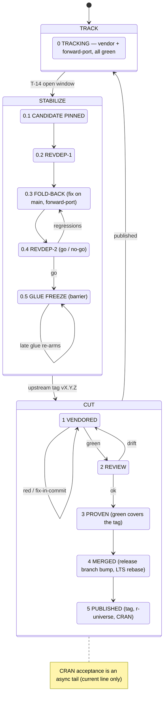

# The release process

Releasing one DuckDB line, as a **finite state machine**:
clusters, states, gates, multi-line coordination, and rollback.
It operates on the branch model of
[`branches/model/`](/handbook/branches/model/README.md)
and must leave every series invariant standing
([`branches/invariants/`](/handbook/branches/invariants/README.md)).
The reverse-dependency runs are
[`testing/revdep/`](/handbook/testing/revdep/README.md)'s,
the version counters
[`versioning/`](/handbook/operations/releases/versioning/README.md)'s,
and CRAN submission
[`cran/`](/handbook/operations/releases/cran/README.md)'s.

Three placeholders run through this page, and nothing else stands in for
a name.
`<S>` is the series — one upstream line of `duckdb/duckdb`, and the refs
that carry it.
`N` is its `major.minor` token, which is what a flavor suffix is built from
([`branches/flavors/`](/handbook/branches/flavors/README.md)).
`X.Y.Z` is the version being released.

Four refs matter here:

* **the release branch** — `main` for the current line,
  the parked `vX-codename` branch for a line that is no longer current,
  in `duckdb/duckdb-r`.
  It sits at the last release and is what CRAN and r-universe publish.
* **`<S>-lts`** — the release branch plus the flavor rename,
  where an LTS line has one.
* **`<S>-dev`** — what CI judges commit by commit,
  and what the `.dev` flavor is built from.
* **`<S>-green`** — the trusted frontier
  ([`branches/model/`](/handbook/branches/model/README.md)).

Green moves itself: the series loop fast-forwards it over commits with
recorded successful runs, so promoting a release point is not a step
anyone performs.

At any moment a series is in exactly one of three **clusters**.
The clusters — not the individual states — are the unit of coordination
when several series release together
(see [Multi-line coordination](#multi-line-coordination)).

## Clusters

| Cluster | States | Driver | Mutates `main` glue? | Vendored commits → mainline? | Loops? |
|---------|--------|--------|----------------------|------------------------------|--------|
| **TRACK** | 0 | the series loop | no — forward-ports pass *through* | no | — |
| **STABILIZE** | 0.1–0.5 | calendar / human (T−14 → tag) | **yes** (fold-back fixes are born here) | no | revdep ⇄ fold-back |
| **CUT** | 1–5 | upstream tag, then mechanical | no | **yes — the only cluster that does** | red ⇄ fix-in-commit |

The single most important property of the whole design is the pair of
middle columns: **vendored commits enter the mainline in exactly one
cluster (CUT), and `main`'s glue changes only in TRACK and STABILIZE.**
The two never overlap,
which is what keeps `main` CRAN-releasable at all times.

## State diagram



## States

| State | Enter when | `<S>-dev` | `<S>-green` | release / `-lts` branch | Gate to leave | On failure |
|-------|-----------|-------|-----------|------------------|---------------|------------|
| **0 TRACKING** | the previous release published | grows: vendor + forward-port | advances with CI | frozen at `X.Y.(Z-1)` | maintainer opens window (≈ T−14) | — |
| **0.1 CANDIDATE PINNED** | window opens | fixes only; pin likely release commit | advances with CI | frozen | candidate green | — |
| **0.2 REVDEP-1** | candidate pinned | — | — | — | revdep run triaged | — |
| **0.3 FOLD-BACK** | findings exist | fold-back forward-ports land | advances with CI | **fixes born on `main`**, then ported | findings resolved/accepted | loop to 0.4 |
| **0.4 REVDEP-2** | ≈ T−7 | — | — | — | **go / no-go** | fail → 0.3 |
| **0.5 GLUE FREEZE** | go | frozen (barrier; all lines aligned) | catches up, then frozen | frozen | upstream tags `vX.Y.Z` | late glue → re-arm 0.5 |
| **1 VENDORED** | tag lands on `<S>-dev` | tagged vendor commit present | advancing toward the tag | frozen | tagged commit **green** (`each.yaml`) | red → fix in-commit, force-push `<S>-dev` |
| **2 REVIEW** | green | — | — | — | release branch `..tagged` clean | drift → fix on `main`, forward-port |
| **3 PROVEN** | review ok | — | **has advanced over the tagged commit** | — | green covers the tag | red → 1 |
| **4 MERGED** | proven | frozen at tagged commit | — | tagged content merged; `fledge` bump to `X.Y.Z`; `-lts` rebased | release branch green | version conflict (merge driver) / red CI |
| **5 PUBLISHED** | merged | — | — | tag `vX.Y.Z` pushed; r-universe builds; CRAN submitted (current line) | tag pushed | CRAN reject → new patch cycle |

The **On failure** column is the whole of rollback:
there is no state this machine cannot be walked back out of,
and no failure that discards a green commit.

## TRACK — steady state

Nothing to do: this is the series loop running unattended
([`operations/vendoring/series-loop/`](/handbook/operations/vendoring/series-loop/README.md)),
with `each.yaml` judging every new commit,
and glue changes flowing in from `main` through the forward-port chain.
The trusted frontier is "what would ship if we released now."

A maintainer leaves TRACK by **opening the release window**,
about two weeks before the expected upstream release date,
which enters STABILIZE.

## STABILIZE — pre-release (≈ T−14 → tag)

The goal is to prove the release *candidate* against reverse dependencies
**before upstream cuts the tag**,
so that regressions can be folded back — into the glue, into `patch/`,
or reported upstream — while there is still time.
STABILIZE mutates only `main` (fold-back fixes)
and `<S>-dev` (forward-ports plus ongoing vendoring);
the release branches stay at the previous release,
so the whole cluster is abortable with zero rollback.

### Preflight

* Review the upstream **R workflow** `R CMD check`
  for the candidate revision:
  <https://github.com/duckdb/duckdb/actions/workflows/R.yml>.
  Errors and warnings are show-stoppers.
  The package-size NOTE and the "Note to CRAN Maintainers" are fine;
  other NOTEs usually indicate real problems.
* Review the current **CRAN checks** page:
  <https://cran.r-project.org/web/checks/check_results_duckdb.html>.
  Anything in red, or any WARNING or NOTE other than package size,
  must be addressed.

### 0.1 Pin the release candidate

Upstream commits land up to and including release day,
so the release commit is a moving target.
**Ask upstream for the most likely release commit** and pin it.
From here, only fixes flow into the glue source of truth, not features.
Re-pin as upstream advances;
a re-pin forces a re-run of the reverse-dependency checks only if the
delta touches anything risky — what ships must have been tested.

### 0.2 / 0.4 Reverse-dependency checks

Two runs against the pinned candidate:
an early pass with time to act on what it finds,
and a second at about T−7 that is the go/no-go gate.
How they are run and where the results land is `testing/revdep/`'s.

### 0.3 Fold back

Every fold-back fix is **born on `main`** and forward-ported down the
chain — never authored directly on a `<S>-dev` branch.
C++ issues go into `patch/` and are simultaneously sent upstream as a
pull request, so the patch can eventually retire
([`operations/vendoring/pipeline/`](/handbook/operations/vendoring/pipeline/README.md)).
Contact the maintainers of any broken reverse dependencies.
Loop back to 0.4 until clean or explained.

### 0.5 Glue freeze (barrier)

Freeze glue across **all** releasing series
and confirm `git cherry main <S>-dev` is empty for each —
every releasing line now carries identical glue.
A late glue change after this point is allowed
but **re-arms the freeze**: land it on `main`,
forward-port it to every releasing `<S>-dev`, re-run a targeted revdep,
and only then proceed.
The clock resets to 0.5; it is not a scramble.

## CUT — release execution

Triggered by upstream tagging `vX.Y.Z`.
This is the only cluster that moves vendored commits into the mainline,
and it does so through reviewed, green, gated steps.
**You release the tagged commit, not the `<S>-dev` tip** —
upstream has usually moved on by now,
and the post-tag commits stay queued for the next cycle.

### 1 VENDORED → 2 REVIEW → 3 PROVEN

1. The series loop produces the `vendor: … (tag vX.Y.Z) …` commit on
   `<S>-dev`; wait for `each.yaml` to show it **green**.
   If vendoring broke the build, fix it in the same commit and
   force-push `<S>-dev`.
2. Review the pending window — the release branch against the tagged
   commit, which is what the *ahead* badge counts — and confirm it holds
   only the expected vendor commits and intended forward-ports,
   with no glue drift.
3. Nothing to promote: the loop fast-forwards `<S>-green` over the tagged
   commit as soon as it is green.
   Confirm green covers it before going on.

### 4 MERGED — the release branch and the version bump

Bring the tagged `<S>-dev` content onto the release branch
**linearly, never as a merge commit** — the active history stays
merge-free so it stays bisectable.
Fast-forward or rebase the tagged range onto the release branch,
dropping the flavor rename commit.
The `DESCRIPTION` version conflict is resolved automatically by the merge
driver (`versioning/`);
run [`scripts/setup-git.sh`](/scripts/setup-git.sh) first
if this is a fresh clone or CI runner.
Because `<S>-dev` descends from its release point,
the only rewriting is dropping that rename.

The package version is **not** derived from the git tag —
set it explicitly so `DESCRIPTION` matches the upstream tag:

```r
fledge::bump_version("X.Y.Z")
```

Then rebase the LTS branch, one rename commit on top of the release branch:

```bash
# in the <S>-lts worktree
git rebase origin/<S> && git push origin <S>-lts
```

Build the source tarball and take it through WinBuilder and the CRAN
preflight before tagging (`cran/`).

### 5 PUBLISHED — tag and publish

Tag the release and push; r-universe rebuilds automatically:

```bash
git tag vX.Y.Z origin/<S>-lts   # or origin/<S> per series convention
git push origin vX.Y.Z
```

For the **current** line only, submit to CRAN (`cran/`).
Acceptance is asynchronous and overlaps the next TRACK,
so the tag and the r-universe publish do not wait for it;
a rejection is fixed on the release branch and re-enters CUT as a follow-up patch.

### Back to TRACK

There is no re-baselining step. `<S>-dev` and `<S>-green` carry straight on
past the release point, and the series is in TRACK again the moment the
release branch has moved. What used to happen here was rebuilding a series
that had not been reseeded into the loop, from the released tip plus the
flavor rename; every series runs the loop now
([`branches/model/`](/handbook/branches/model/README.md)).

Separately, the glue source of truth (`main`) moves to its ongoing
development version via `fledge` (`versioning/`).
The vendor counter is not a release-time concern: it rises on `<S>-dev` as
the buffer is consumed, and the one thing that re-derives it is a forward
rebuild, which has nothing to do with a release having happened.

## Multi-line coordination

When several series release together —
a current line on CRAN plus an LTS line on r-universe —
coordinate at the **cluster** level:

* **STABILIZE ends on a shared barrier.**
  All releasing lines must reach **0.5 GLUE FREEZE** together;
  this is the forward-port barrier that guarantees identical glue across
  lines, and it is the one hard synchronization point.
* **CUT runs per line, pipelined, CRAN line first.**
  Submit the CRAN line early because its acceptance is asynchronous;
  the r-universe-only LTS line finishes alongside with no CRAN tail.
* **The preview line** — the one tracking upstream `main` —
  lives in a long-running TRACK/STABILIZE:
  its STABILIZE *is* the upstream release-candidate window.
  Its CUT is the atomic fast-forward flip of `main`, which needs `main` to be
  an ancestor of `main-dev`: not maintained continuously, and established once
  just before the flip by rewinding to the bifurcation and replaying.
  That is what a line with no series of its own requires.
  Where the release branch is opened as a series instead, its release is the
  ordinary linear move onto `main` and there is no flip, which is what the next
  major is planned to do
  ([`plan/PLAN-v2-series-open.md`](/plan/PLAN-v2-series-open.md)).
  Either way the durations differ from an ordinary line's and the machine does
  not, and the one other addition is that vendor-coupled glue may be *born* on
  the line's `<S>-dev`, the documented exception to R-side work being born on
  `main`.

## What each cluster must leave standing

Every cluster hands the series on with its invariants intact:

* **TRACK and STABILIZE** keep the flavor names internally consistent,
  the history linear, the glue identical down the forward-port chain,
  and every `<S>-dev` commit green.
* **CUT** is the controlled transition where the release branches advance
  to the tagged commit `<S>-green` has already proven;
  the version and flavor invariants must hold at the new release point,
  and the series is back in TRACK with the same refs it had.
